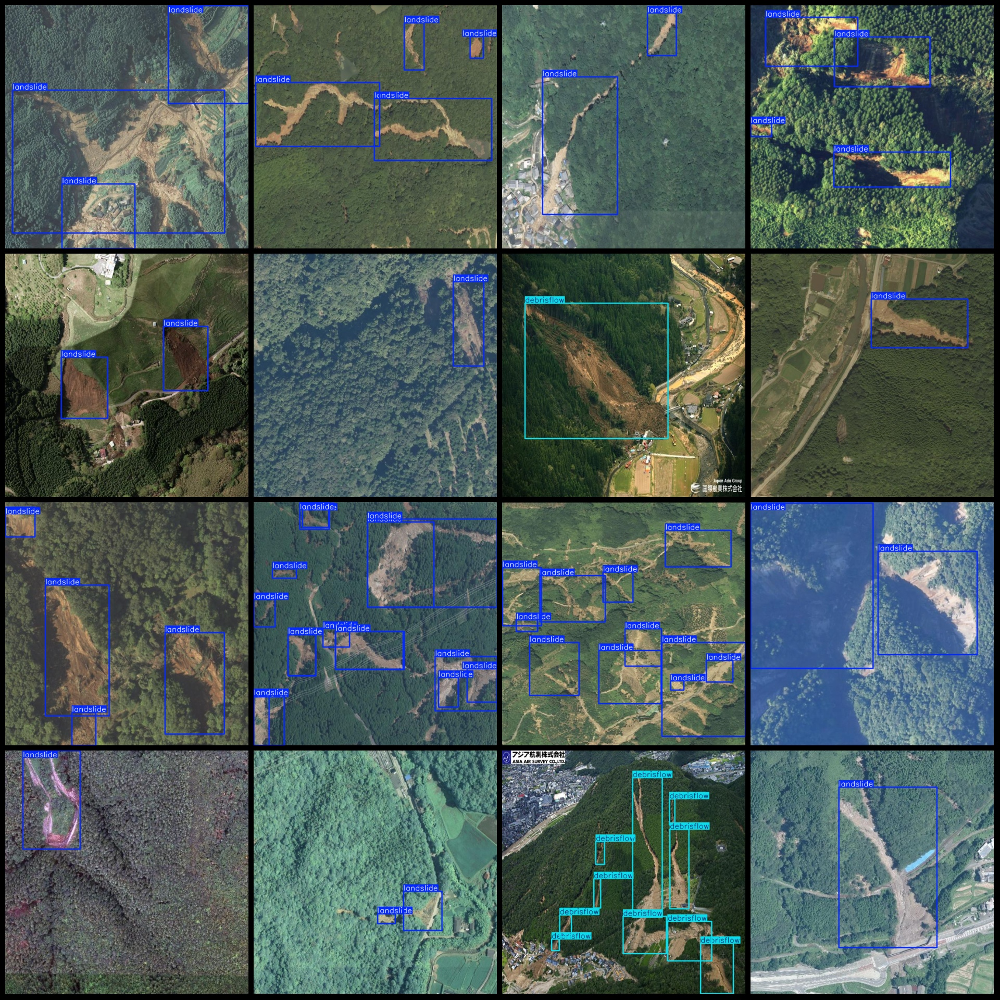
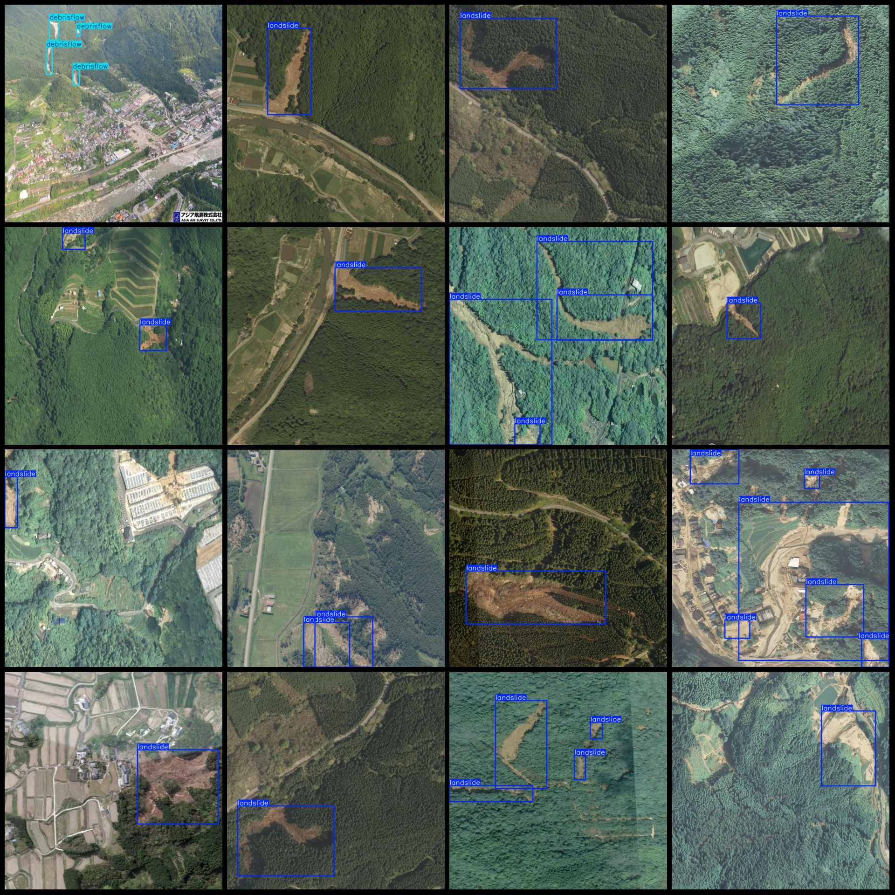

# Drone Perspective Landslide and Mudslide Detection Dataset VOC+YOLO Format with 2262 Images in 2 Categories

Note: One-third of the images in the dataset are original, while the remaining are enhanced. The main enhancement is rotation.

Dataset Format: Pascal VOC format + YOLO format (without split path txt files, only containing jpg images and corresponding VOC format xml files and yolo format txt files)

Number of Images (jpg file count): 2262
Number of Annotations (xml file count): 2262
Number of Annotations (txt file count): 2262
Number of Annotation Categories: 2
Annotation Category Names (Note that the order of labels in the yolo format is not consistent with this, but is based on the classes.txt file in the labels folder): ["debrisflow", "landslide"]
Number of Boxes per Category:
debrisflow (mudslide) boxes = 429
landslide (landslide) boxes = 6079
Total Boxes = 6508
Image Resolution: 640x640
Used Labeling Tool: labelImg
Labeling Rules: Draw bounding boxes for categories
Important Note: No special statements at this time.
Special Declaration: This dataset does not guarantee the accuracy of the trained models or weight files.
Image Preview:
Annotation Example:

## Images

Here is a pay link on Stripe ( https://buy.stripe.com/3cs8yP7sY87d0vu9AB ). Please contact me lonlonago@foxmail.com after funding $89, and I will send you a complete data files , thank you!

